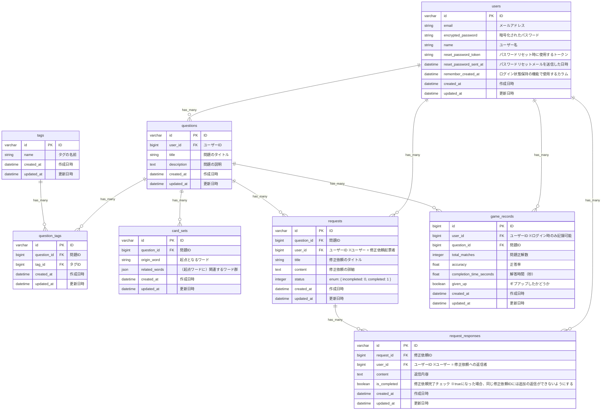

## ■サービス概要
「NeuroWord（ニューロワード）」は、単語や用語とその関連語・説明を一覧表示し、正しい組み合わせを選んでいくWebサービスです。  
最大10枚のカードを使ったゲーム感覚の設計で、関連する語句を探し出すことで情報を整理し、記憶の定着に繋げます。  
資格試験やプログラミングの学習にも役立つ、「探し出す」ことを通じて記憶への定着を目指す新しい学習ツールです。  

## ■ このサービスへの思い・作りたい理由
プログラミングや資格の勉強をしていると、「覚える」という作業を避けて通れません。  
もちろん、知識を芋づる式に繋げて理解を深めることも重要ですが、理解した内容を必要なときにすぐに思い出すためには、ある程度の暗記も欠かせないと感じています。  
一般的な暗記ツールとしては「暗記カード」がありますが、大量のカードの内容を暗記するには学習者に負荷がかかります。また、基本的に1対1の関係での記憶に限られるため、多数の言葉を関連づけて覚えたい場合にはあまり適していません。  
そこで私は、最初から「思い出す」ことを目指すのではなく、「探し出す」ことを通じて記憶の定着を目指す、もっと気軽に楽しく学べるツールを作りたいと考えました。  
さらに、1対1だけではなく、複数の言葉の関連性を活用しながら、自然に知識を深められる仕組みを目指しています。  

## ■ ユーザー層について
下記のような学習者を対象とします。
- 資格試験学習者
- プログラミング学習者
- 語学学習者
- 学生・社会人の生涯学習者

【上記を対象とした理由】  
資格や語学、プログラミングなどの学習では、専門用語や概念の理解に加え、記憶の定着が不可欠です。  
しかし、従来の暗記学習は単調になりやすく、モチベーションの維持が課題となっています。  
このサービスでは、ゲーム感覚で関連語を「探す」設計により、繰り返し学習への心理的ハードルを下げます。  
また、語句同士の関連性に着目することで、断片的な暗記にとどまらない理解の構築をサポートし、幅広い学習層に対応できる仕組みとしています。  

## ■サービスの利用イメージ
#### ◇ 問題選択
ユーザー登録無しでトップページから問題一覧を閲覧し、興味のある問題を選択してすぐにゲームを始められます。  
問題一覧は、作成日時・総挑戦回数・リスト登録数によるソートや、タグ・フリーワード・修正依頼有無による絞り込みが可能です。  
#### ◇ ゲームスタート画面
各問題直前に、ゲームスタート画面を用意しております。ここでスタートボタンを押すことで、ゲーム及び時間計測がスタートします。  
この画面で、問題に対する修正依頼・修正依頼内容の確認も可能です。  
#### ◇ 問題画面
問題画面では、最大10枚のカードから正しい単語と関連語の組み合わせを探し出し、マッチング完了を目指します。  
どうしても正しい組み合わせがわからない場合は、ギブアップも可能です。
#### ◇ 結果画面
ゲーム終了後の結果画面で正解の組み合わせとスコア（正答率・解答にかかった時間）を確認し、X（Twitter）への投稿機能で学習成果をシェアします。  
この画面からも、問題に対する修正依頼・修正依頼内容の確認が可能です。  
#### ◇ ログインで使用できる機能
アカウント作成・ログイン後は、オリジナル問題の作成や投稿、気になる問題のリスト登録、問題に対するコメント・修正依頼の投稿が可能です。  
#### ◇ マイページのイメージ
マイページでプロフィール設定、自作問題の管理・編集、リストの整理、学習履歴や修正依頼の確認を行い、個人の学習環境をカスタマイズできます。  
  
 ### 用語定義
- `問題` : 起点となる単語とその関連語の組み合わせを当てる1つのゲーム単位。
- `リスト` : タグとは別に、ログインユーザーが作成できる、問題の集合リスト（お気に入り的な位置づけ）。リスト作成者が公開/非公開を選択できます。
- `スコア` : 正答率・解答にかかった時間。
- `学習履歴` : 総挑戦数、挑戦した問題およびそのスコアの記録を表示します。一定の総挑戦数ごとで、X（Twitter）へのシェアも可能です。

### ■ ゲームの流れ
#### 問題例:
- 問題タイトル: "情報資産に対するリスク"
- 画面に表示されるカード（計6枚）
  - 起点単語A: "脆弱性"  
  - Aの関連語群: ["ワイヤー固定していないデスクトップ", "暗号化しない通信"]
  - 起点単語B: "脅威"  
  - Bの関連語群: ["不正アクセス", "火災"]
  
#### ゲームの進め方:
1. まず起点Aのカード「脅威」を選択
2. 「脅威」に関連する「不正アクセス」「火災」を選択（順不同）
3. 次に起点Bのカード「脆弱性」を選択
4. 「脆弱性」に関連する「暗号化しない通信」「ワイヤー固定していないデスクトップ」を選択（順不不同）
5. A/B全ての組み合わせが正解でクリア！

## ■ ユーザーの獲得について
### 新規ユーザーの獲得
- ユーザー登録無しですぐにゲームを始められるようにし、サービス利用のハードルを下げます。
- X（Twitter）への投稿機能で学習成果を気軽にシェアできるようにします。
### 既存ユーザーの維持
- タグやリストで、気になる問題にアプローチしやすい環境を用意します。
- マイページで学習履歴を可視化し、習慣化を支援します。
### 幅広いユーザーからの問題ページ投稿促進
- MVP時点で開発者自身が5～10個程度の問題ページを投稿し、関連語の作成イメージを提供します。
- 上記作成ページの中には一般マナーや面白ネタ寄りといった、より幅広いユーザーが新規問題を作りたくなるようなジャンルも用意します。
- タグの表記ゆれ影響を最小限とするため、タグの追加・検索時はオートコンプリートを使用します。
#### ◇ MVP時点で作成する問題×タグ付与例
- git操作 × `#プログラミング` `#git` `#IT`
- 情報資産に対するリスク × `#IT` `#ITセキュリティ` `#基本情報試験`
- 英単語とその日本語訳 × `#英語` `#語学学習`
- 尊敬語・謙譲語 × `#マナー` `#秘書検定2級` `#就活`
- ゴリラ豆知識 × `#ネタ` `#雑学` `#ゴリラ` `#研究`

## ■ サービスの差別化ポイント・推しポイント
### 「探す」ことが主軸の記憶定着アプローチ
- 一般的な暗記アプリは「覚えたかどうかを試す」スタイル（例：穴埋め・暗記カード）ですが、NeuroWordは「関連語を探し出す」ことで自然な連想と整理ができます。
- 脳の検索活動を促進し、記憶の接続性を強化します。

### 最大10枚のカードを使った“ミニゲーム設計”
- シンプルで短時間でも遊ぶことができ、達成感も味わえます。
- 制限枚数を設けることで、集中力・選択力・関連づけ力を刺激します。

### 1対1に限らない多対多の関連づけ学習が可能
- 暗記カードや[Anki](https://apps.ankiweb.net/)は「A⇔B」という1対1記憶に特化。
- それに対してNeuroWordは、「ある単語と関連語たち」を組み合わせる設計で、用語群ごとのまとまり記憶やネットワーク記憶に適しています。

### ユーザー投稿型問題が中心の“共創型”設計
- 一方通行の問題集ではなく、ユーザーが自分の学習範囲で問題を作成・公開できます。
- 似た悩みを持つ他者の投稿や感想も閲覧でき、共感・応援を感じながら学習可能です。

## ■ 機能候補
現段階で大まかに実装したい機能の候補は下記になります。今後変更の可能性もあります。  
  
### MVPリリース
- ユーザー登録機能(メールアドレスとパスワードによる簡易的なもの)
- ログイン機能
- ログアウト機能
- 公開問題一覧の表示機能
  - 検索機能
- ゲーム機能
	- 最大10枚のカードマッチングゲーム
	- 起点カード → 関連カード選択のゲームロジック
	- カード選択時の正解/不正解フィードバック
  - ギブアップ機能
  - 結果画面の正解表示
  - 修正依頼機能
- マイページ機能
	- 自作問題の CRUD（登録・参照・更新・削除）機能

### 本リリース
- googleアカウントによるユーザー認証機能
- パスワードリセット
- ページネーション
- ファビコン
- レスポンシブ対応
- X（Twitter）シェア機能
- OGP
- お問い合わせ
- 利用規約
- プライバシーポリシー
- 公開問題一覧の表示機能
  - ソート機能（作成日時・総挑戦回数・リスト登録数）
  - タグ機能（オートコンプリート機能含む）
- スコア機能（正答率・解答にかかった時間）
- 公開リストの一覧表示機能
- マイページ追加機能
	- 学習履歴機能：総挑戦数、挑戦した問題、スコア(問題ごとの正答率・解答にかかった時間)の記録
	- リストのCRUD（登録・参照・更新・削除）機能　※公開/非公開選択機能
  - リストの連続プレイ機能

## ■ 機能の実装方針予定
こちらも、現段階の予定になります。今後変更となる可能性もあります。  

- 検索機能：gem ransack
- 動的OGP：Cloudinary

### スタック技術

| カテゴリ       | 技術                             |
|----------------|----------------------------------|
| バックエンド   | Ruby on Rails 7.2 / Ruby 3.4     |
| フロントエンド | TailwindCSS / daisyUI           |
| データベース   | PostgreSQL                       |
| デプロイ       | Render                           |
| 認証           | gem devise / OmniAuth            |

### ■ 画面遷移図
[Figma](https://www.figma.com/design/xme6s96ehELySbIOnt31U7/NeuroWord?node-id=0-1&t=V4JqtNMmzldeBCQM-1)

### ■ ER図
