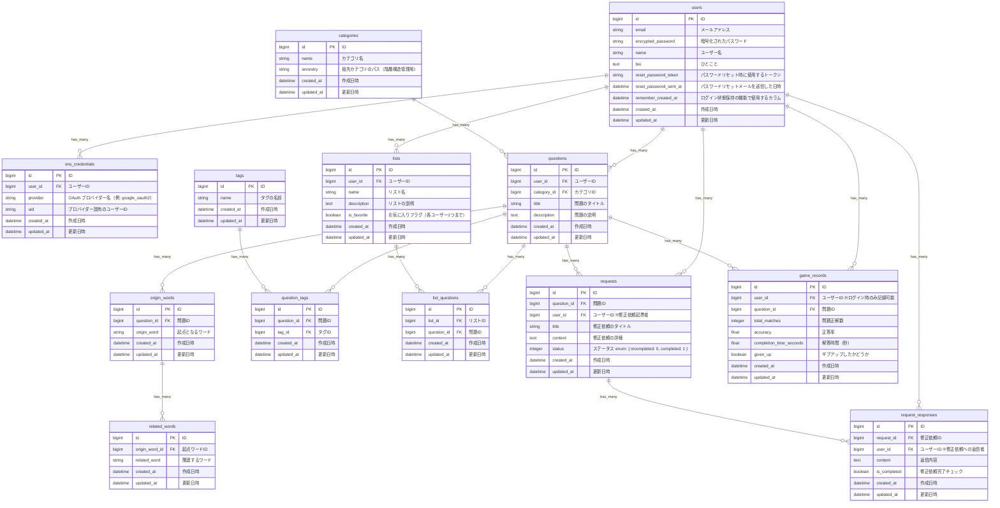

# [NeuroWord～仲間の言葉を見つけよう！～](https://neuroword-nk.com/)
 

#  目次
- [NeuroWord～仲間の言葉を見つけよう！～](#neuroword仲間の言葉を見つけよう)
- [ 目次](#-目次)
  - [ サービス概要](#-サービス概要)
  - [ NeuroWordの推しポイント](#-neurowordの推しポイント)
    - [1対1に限らない多対多の関連づけ学習が可能](#1対1に限らない多対多の関連づけ学習が可能)
    - [「探す」ことが主軸の記憶定着アプローチ](#探すことが主軸の記憶定着アプローチ)
    - [最大10枚のカードを使った“ミニゲーム設計”](#最大10枚のカードを使ったミニゲーム設計)
    - [ユーザー投稿型問題が中心の“共創型”設計](#ユーザー投稿型問題が中心の共創型設計)
  - [ このサービスを作った理由](#-このサービスを作った理由)
  - [ ターゲットユーザー](#-ターゲットユーザー)
  - [ 主要な機能](#-主要な機能)
    - [◇ ログイン不要の機能](#-ログイン不要の機能)
    - [◇ ログインすると使用できる機能](#-ログインすると使用できる機能)
    - [用語定義](#用語定義)
    - [ ゲームの流れ](#-ゲームの流れ)
      - [問題例:](#問題例)
      - [ゲームの進め方:](#ゲームの進め方)
  - [ ユーザーの獲得について](#-ユーザーの獲得について)
    - [新規ユーザーの獲得](#新規ユーザーの獲得)
    - [既存ユーザーの維持](#既存ユーザーの維持)
    - [幅広いユーザーからの問題ページ投稿促進](#幅広いユーザーからの問題ページ投稿促進)
      - [◇ MVP時点で作成する問題×タグ付与例](#-mvp時点で作成する問題タグ付与例)
  - [ 使用技術](#-使用技術)
    - [主要な使用技術と用途](#主要な使用技術と用途)
      - [認証・セキュリティ](#認証セキュリティ)
      - [データ検索・表示](#データ検索表示)
      - [UI/UXデザイン](#uiuxデザイン)
      - [フロントエンドツール](#フロントエンドツール)
      - [データ可視化](#データ可視化)
      - [外部サービス連携](#外部サービス連携)
  - [ ER図](#-er図)
  - [ 画面遷移図](#-画面遷移図)
****
##  サービス概要
「NeuroWord（ニューロワード）」は、単語や用語とその関連語・説明を一覧表示し、正しい組み合わせを選んでいくWebサービスです。  
最大10枚のカードを使ったゲーム感覚の設計で、関連する語句を探し出すことで情報を整理し、記憶の定着に繋げます。  
資格試験やプログラミングの学習にも役立つ、「探し出す」ことを通じて記憶への定着を目指す新しい学習ツールです。  

##  NeuroWordの推しポイント
### 1対1に限らない多対多の関連づけ学習が可能
- 暗記カードや[Anki](https://apps.ankiweb.net/)は「A⇔B」という1対1記憶に特化。
- それに対してNeuroWordは、「ある単語と関連語たち」を組み合わせる設計で、用語群ごとのまとまり記憶やネットワーク記憶に適しています。

### 「探す」ことが主軸の記憶定着アプローチ
- 一般的な暗記アプリは「覚えたかどうかを試す」スタイル（例：穴埋め・暗記カード）ですが、NeuroWordは「関連語を探し出す」ことで自然な連想と整理ができます。
- 脳の検索活動を促進し、記憶の接続性を強化します。

### 最大10枚のカードを使った“ミニゲーム設計”
- シンプルで短時間でも遊ぶことができ、達成感も味わえます。
- 制限枚数を設けることで、集中力・選択力・関連づけ力を刺激します。

### ユーザー投稿型問題が中心の“共創型”設計
- 一方通行の問題集ではなく、ユーザーが自分の学習範囲で問題を作成・公開できます。
- Xシェア機能を通して似た悩みを持つ他者の投稿や感想も閲覧でき、共感・応援を感じながら学習可能です。

##  このサービスを作った理由
プログラミングや資格の勉強をしていると、「覚える」という作業を避けて通れません。  
もちろん、知識を芋づる式に繋げて理解を深めることも重要ですが、理解した内容を必要なときにすぐに思い出すためには、ある程度の暗記も欠かせないと感じています。  
一般的な暗記ツールとしては「暗記カード」がありますが、大量のカードの内容を暗記するには学習者に負荷がかかります。また、基本的に1対1の関係での記憶に限られるため、多数の言葉を関連づけて覚えたい場合にはあまり適していません。  
そこで私は、最初から「思い出す」ことを目指すのではなく、「探し出す」ことを通じて記憶の定着を目指す、もっと気軽に楽しく学べるツールを作りたいと考えました。  
さらに、1対1だけではなく、複数の言葉の関連性を活用しながら、自然に知識を深められる仕組みを目指しています。  

##  ターゲットユーザー
下記のような学習者を対象とします。
- 資格試験学習者
- プログラミング学習者
- 学生・社会人の生涯学習者

【上記を対象とした理由】  
資格やプログラミングの学習では、専門用語や概念の理解に加えて記憶の定着が不可欠です。  
しかし、従来の暗記学習は単調になりやすく、モチベーションの維持が課題となっています。  
このサービスでは、ゲーム感覚で関連語を「探す」設計により、繰り返し学習への心理的ハードルを下げます。  
また、語句同士の関連性に着目することで、断片的な暗記にとどまらない理解の構築をサポートし、幅広い学習層に対応できる仕組みとしています。  

##  主要な機能
### ◇ ログイン不要の機能

<table>
  <tr><th width="320">問題一覧</th><th width="320">ゲームをプレイ</th></tr>
  <tr>
    <td></td>
    <td></td>
  </tr>
  <tr>
    <td>ユーザー登録無しでトップページから問題一覧を閲覧し、興味のある問題を選択してすぐにゲームを始められます。</td>
    <td>問題画面では、最大10枚のカードから正しい単語と関連語の組み合わせを探し出し、マッチング完了を目指します。 どうしても正しい組み合わせがわからない場合は、ギブアップも可能です。</td>
  </tr>
</table>

<table>
  <tr><th width="320">ゲーム結果を見る</th><th width="320">ゲーム結果をシェア</th></tr>
  <tr>
    <td></td>
    <td></td>
  </tr>
  <tr>
    <td>ゲーム終了後の結果画面で正解の組み合わせとスコア（正答率・クリック数・解答にかかった時間）を確認できます。</td>
    <td>X（Twitter）への投稿機能で学習成果をシェアできます。</td>
  </tr>
</table>

### ◇ ログインすると使用できる機能

<table>
  <tr><th width="320">問題投稿</th></tr>
  <tr>
    <td></td>
  </tr>
  <tr>
    <td>アカウント作成・ログイン後は、オリジナル問題の作成や投稿が可能です。</td>
  </tr>
</table>

<table>
  <tr><th width="640">投稿した問題をシェア</th></tr>
  <tr>
    <td class="flex">
        
        
    </td>
  </tr>
  <tr>
    <td>作成した問題は、X（Twitter）への投稿機能でシェアできます。</td>
  </tr>
</table>

<table>
  <tr><th width="320">お気に入り追加・削除</th><th width="320">リスト作成・削除</th></tr>
  <tr>
    <td></td>
    <td></td>
  </tr>
  <tr>
    <td>アカウント作成・ログイン後は、気になる問題のリスト登録も可能です。</td>
    <td>ユーザー自身で任意のリスト作成も可能です。</td>
  </tr>
</table>

<table>
  <tr><th width="320">リストをまとめてプレイ</th><th width="320">修正依頼の投稿</th></tr>
  <tr>
    <td></td>
    <td></td>
  </tr>
  <tr>
    <td>リスト登録した問題は、まとめてプレイ機能による効率的な学習も可能です。</td>
    <td>アカウント作成・ログイン後は、問題に対する修正依頼の投稿も可能です。</td>
  </tr>
</table>

<table>
  <tr><th width="320">理解した問題を非表示</th><th width="320">学習履歴を確認</th></tr>
  <tr>
    <td></td>
    <td></td>
  </tr>
  <tr>
    <td>アカウント作成・ログイン後は、2週間以内に解答率が80%以上となった問題の除外が可能です。</td>
    <td>アカウント作成・ログイン後は、学習履歴の確認も可能です。</td>
  </tr>
</table>

  
 ### 用語定義
 ★：ログインユーザーのみ使用可能  
- `問題` : 起点となる単語とその関連語の組み合わせを当てる1つのゲーム単位。
- ★ `リスト` : タグとは別に、ログインユーザーが作成できる、問題の集合リスト（お気に入り的な位置づけ）。
- ★ `まとめてプレイ機能`：リストに追加した問題を連続でプレイし、最後にまとめて結果を確認できる機能。
- `スコア` : 正答率・クリック数・解答時間。
- ★ `学習履歴` : 総挑戦数、挑戦した問題およびそのスコアの記録を表示します。
- ★ `修正依頼` : 問題に対する誤りや改善提案を投稿できる機能。

###  ゲームの流れ
#### 問題例:
- 問題タイトル: "情報資産に対するリスク"
- 画面に表示されるカード（計6枚）
  - 起点単語A: "脆弱性"  
  - Aの関連語群: ["ワイヤー固定していないデスクトップ", "暗号化しない通信"]
  - 起点単語B: "脅威"  
  - Bの関連語群: ["不正アクセス", "火災"]
  
#### ゲームの進め方:
1. まず起点Aのカード「脅威」を選択
2. 「脅威」に関連する「不正アクセス」「火災」を選択（順不同）
3. 次に起点Bのカード「脆弱性」を選択
4. 「脆弱性」に関連する「暗号化しない通信」「ワイヤー固定していないデスクトップ」を選択（順不不同）
5. A/B全ての組み合わせが正解でクリア！

##  ユーザーの獲得について
### 新規ユーザーの獲得
- ユーザー登録無しですぐにゲームを始められるようにし、サービス利用のハードルを下げます。
- X（Twitter）への投稿機能で学習成果を気軽にシェアできるようにします。
### 既存ユーザーの維持
- タグやリストで、気になる問題にアプローチしやすい環境を用意します。
- マイページで学習履歴を可視化し、習慣化を支援します。
### 幅広いユーザーからの問題ページ投稿促進
- MVP時点で開発者自身が5～10個程度の問題ページを投稿し、関連語の作成イメージを提供します。
- 上記作成ページの中には一般マナーや面白ネタ寄りといった、より幅広いユーザーが新規問題を作りたくなるようなジャンルも用意します。
- タグの表記ゆれ影響を最小限とするため、タグの追加・検索時はオートコンプリートを使用します。
#### ◇ MVP時点で作成する問題×タグ付与例
- git操作 × `#プログラミング` `#git` `#IT`
- 情報資産に対するリスク × `#IT` `#ITセキュリティ` `#基本情報試験`
- 尊敬語・謙譲語 × `#マナー` `#秘書検定2級` `#就活`
- ゴリラ豆知識 × `#ネタ` `#雑学` `#ゴリラ` `#研究`

##  使用技術

| カテゴリ       | 技術                             |
|----------------|----------------------------------|
| バックエンド   | Ruby 3.3.6 / Ruby on Rails 7.2.3  |
| フロントエンド | TailwindCSS / daisyUI / Hotwire (Turbo, Stimulus)          |
| データベース   | PostgreSQL                       |
| デプロイ       | Render                           |
| 認証           | Devise / OmniAuth (Google OAuth2)|

### 主要な使用技術と用途
#### 認証・セキュリティ
* Devise - ユーザー認証機能（メール/パスワード認証、パスワードリセット）
* OmniAuth - Google OAuth2による外部認証
* Rack Attack - レート制限とセキュリティ保護
#### データ検索・表示
* Ransack - 問題一覧の検索・絞り込み機能
* Kaminari - ページネーション
* Ancestry - カテゴリの階層構造管理
#### UI/UXデザイン
* TailwindCSS / daisyUI - UIデザイン・スタイリング
* Hotwire (Turbo / Stimulus) - SPAライクな動作とインタラクティブな機能
* Gretel - パンくずリスト機能
#### フロントエンドツール
* esbuild - JavaScriptのバンドル
* stimulus-autocomplete - 修正依頼における対象問題指定のオートコンプリート機能
* Tagify - カンマ区切りを要しない直感的なタグ編集・タグのオートコンプリート機能
#### データ可視化
* ECharts (rails_charts) - マイページのカレンダーチャート表示
#### 外部サービス連携
* Cloudinary - 動的OGP画像生成
* meta-tags - OGP・SEO対応
* Cloudflare - 独自ドメイン

##  ER図

##  画面遷移図
[Figma](https://www.figma.com/design/xme6s96ehELySbIOnt31U7/NeuroWord?node-id=0-1&t=V4JqtNMmzldeBCQM-1)